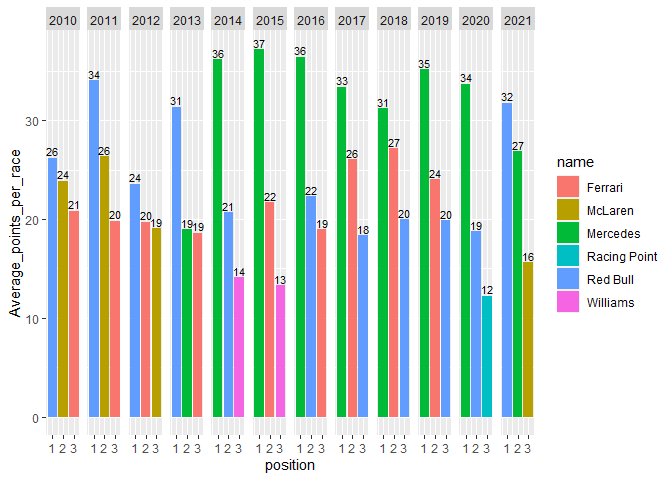
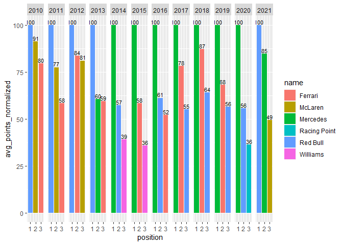
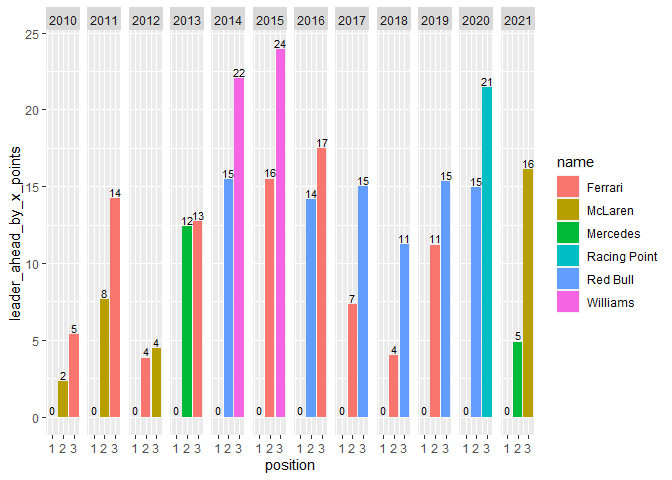

F1 Data Analysis Study
================
Konrad Markowski
14/07/2021

## Task

Finding relationship between current season F1 constructors standings
and the previous years, to determine trends and predict this year
constructors winner.

## Data source

All data comes form [Ergast Developer API](http://ergast.com/mrd/), used
for non-commercial applications and services.

Data from 13.05.1950 to 06.07.2021.

### Used data

**constructor\_standings.csv** - contains data about constructors
standings after each race

    ##   constructorStandingsId raceId constructorId points position positionText wins
    ## 1                      1     18             1     14        1            1    1
    ## 2                      2     18             2      8        3            3    0
    ## 3                      3     18             3      9        2            2    0
    ## 4                      4     18             4      5        4            4    0
    ## 5                      5     18             5      2        5            5    0
    ## 6                      6     18             6      1        6            6    0

**constructors.csv** - contains data about constructors names and their
ids

    ##   constructorId constructorRef       name nationality
    ## 1             1        mclaren    McLaren     British
    ## 2             2     bmw_sauber BMW Sauber      German
    ## 3             3       williams   Williams     British
    ## 4             4        renault    Renault      French
    ## 5             5     toro_rosso Toro Rosso     Italian
    ## 6             6        ferrari    Ferrari     Italian

**races.csv** - contains data about each race

    ##   raceId year round circuitId                  name       date     time
    ## 1      1 2009     1         1 Australian Grand Prix 2009-03-29 06:00:00
    ## 2      2 2009     2         2  Malaysian Grand Prix 2009-04-05 09:00:00
    ## 3      3 2009     3        17    Chinese Grand Prix 2009-04-19 07:00:00
    ## 4      4 2009     4         3    Bahrain Grand Prix 2009-04-26 12:00:00
    ## 5      5 2009     5         4    Spanish Grand Prix 2009-05-10 12:00:00
    ## 6      6 2009     6         6     Monaco Grand Prix 2009-05-24 12:00:00

\*Note that in the preview of the ‘races.csv’ and ‘constructors.csv’
last column named ‘url’ was omited for clarity

## Data scope

Data will be limited to the years 2010-2021. Before 2010 points scoring
system was different form what it is today and using data before 2010 to
preform this analysis could possibly change the outcome. The difference
between scoring system from 2010-2018 and present system is additional 1
point granted for the fastest lap. The influence of fastest lap point is
most likely negligible, because even in the scenario when the team gets
all fastest lap points it only increases their average points per race
by 1, which is really small increase compared to overall scores.

## Data processing

Merging data for further analysis:

``` r
# Merging constructors data with constructors_standings data 

constr_and_constr_standings_merged <- merge(constructors_standings,constructors, by = "constructorId")

# Merging previous merge output with race data

constr_and_races_merged <- merge(constr_and_constr_standings_merged,races, by="raceId")

# Filtering desired data (from the year 2010 and newer)

constr_and_races_merged <- constr_and_races_merged %>% 
  filter(year>=2010)

# Selecting only useful columns

constr_selected <- select(constr_and_races_merged, raceId,points,year,date,name.x)

# Renaming column and data variable for clarity 

constr_organized <-rename(constr_selected,name = name.x)

# Clearing unused objects from memory

rm("constr_selected")
rm("constr_and_races_merged")
rm("constr_and_constr_standings_merged")
rm("races")
rm("constructors")
rm("constructors_standings")
```

Preview of prepared data for analysis:

    ##   raceId points year       date       name
    ## 1    337      0 2010 2010-03-14 Toro Rosso
    ## 2    337      0 2010 2010-03-14      Lotus
    ## 3    337      0 2010 2010-03-14     Sauber
    ## 4    337     43 2010 2010-03-14    Ferrari
    ## 5    337      0 2010 2010-03-14     Virgin
    ## 6    337      1 2010 2010-03-14   Williams

## Analysis

Key elements are determining average amount of points per race scored by
the each team throughout each year and determine how much ahead the
constructors winner is compared to the other teams (mainly second and
third place).

``` r
# Creating new column that will contain number of points gained per race

constr_organized$points_per_race  = c(0)

# Creating new data frame with the same columns as constr_organized

new_constr <- data.frame(matrix(ncol=6, nrow=0))
x <- c("raceId","points","year", "date", "name", "points_per_race")
colnames(new_constr) <- x

# Splitting data by each year and calculating points per race basing on
# total points after each race

for (year_ in 2010:2021) {
  
  # Creating subset, grouping and sorting to preform calculations
  
  constr_subset <- constr_organized %>% 
    filter(year == year_) %>% 
    group_by(name) %>% 
    arrange(name,date)
  
    # Determining first race date in each year and assigning values to points_per_race
    # which equals to total points after 1st race
  
    first_date <- min(constr_subset$date)

    constr_subset$points_per_race[constr_subset$date == first_date] <- 
      constr_subset$points[constr_subset$date == first_date]
    
    # Creating variable containing dates of the each race in given year
    
    dates <- unique(constr_subset$date)
  
    # Calculating points_per_race for every race that is not first race, basing on
    # relation between two races that happened in order, in other words:
    # points per race = total points after race - total points after previous race
    
    previous_date <- first_date
    
     for (date_ in dates) {
      if(date_ != first_date) {
        constr_subset$points_per_race[constr_subset$date ==  date_] <- 
          (constr_subset$points[constr_subset$date == date_] -
           constr_subset$points[constr_subset$date == previous_date])
        
        previous_date <- date_
      }
     }
    
    # Adding calculated data to the new data frame
  
    new_constr <- rbind(new_constr,constr_subset)
    
}

# Because of data inconsistency in some spots, there are negative values;
# for example at the data from the year 2021 there are entries of races that are
# yet to happen, hence some data have negative values

# Filtering negative values and double points race

new_constr <- new_constr %>% 
  filter(points_per_race>=0,date != "2014-11-23")

# Clearing unused objects from memory
  
rm("constr_organized")
rm("constr_subset")
rm("date_")
rm("dates")
rm("first_date")
rm("previous_date")
rm("x")
rm("year_")
```

Preview of the new\_constr data frame:

    ## # A tibble: 6 x 6
    ## # Groups:   name [1]
    ##   raceId points  year date       name    points_per_race
    ##    <int>  <dbl> <int> <date>     <chr>             <dbl>
    ## 1    337     43  2010 2010-03-14 Ferrari              43
    ## 2    338     70  2010 2010-03-28 Ferrari              27
    ## 3    339     76  2010 2010-04-04 Ferrari               6
    ## 4    340     90  2010 2010-04-18 Ferrari              14
    ## 5    341    116  2010 2010-05-09 Ferrari              26
    ## 6    342    136  2010 2010-05-16 Ferrari              20

Note that the theoretical maximum amount of gained points per race
should be 43 points (for 1st and 2nd place) during seasons 2010-2018 and
44 points (1 additional point for the fastest lap) during seasons
2019-2021, but during season 2014 last race was awarded with double
points. Because it might alter the data, this race was filtered out.

Calculated points\_per\_race for the second race in years 2011,2012 and
2015 sometimes yields invalid results, most likely because of some data
inconsistency, due to that, these races are filtered out.

``` r
# Warning message text:

# Warning in constr_subset$points[constr_subset$date == date_] - constr_subset$points[constr_subset$date ==  :
#  longer object length is not a multiple of shorter object length

# Cause of the warning -  mismatch of lengths between subtraction ingredients, reason - unknown 
# Solution - filtering out invalid data

new_constr <- new_constr %>% 
  filter(date != "2011-04-10",date != "2015-03-29", date != "2012-03-25")
```

Calculating average (mean):

``` r
team_avg_by_year <- new_constr %>% 
  group_by(year,name) %>% 
  summarise(Average_points_per_race = mean(points_per_race),.groups = 'drop')


# Clearing unused objects from memory

rm("new_constr")
```

Preview of calculated mean in table:

    ## # A tibble: 6 x 3
    ##    year name        Average_points_per_race
    ##   <int> <chr>                         <dbl>
    ## 1  2010 Ferrari                       20.8 
    ## 2  2010 Force India                    3.58
    ## 3  2010 HRT                            0   
    ## 4  2010 Lotus                          0   
    ## 5  2010 McLaren                       23.9 
    ## 6  2010 Mercedes                      11.3

Preparing data for visualization and calculating additional parameters.

``` r
# Creating subset containing top 3 teams each year, with additional columns 
 
#'position' containing information about ending position of the team 

#'avg_points_normalized' containing information about normalized to winner values of avg points 
# (x_avg_points_normalized = x_place_avg_points/1st_place_avg_points * 100%)

# and "ahead_by_x_points" column containing information about how many points leader is on average ahead
# compared to other teams 
# ( "y_leader_ahead_by_x_points" =  1_place_avg_points-y_place_avg_points)


top_3 <- data.frame(matrix(ncol=6, nrow=0))
colnames(top_3) <- c("year", "name", "Average_points_per_race","avg_points_normalized","position", "leader_ahead_by_x_points")

# Spiting data by year

for (year_ in 2010:2021) {
  
  # Filtering top 3 teams in given year
  
  top_3_by_year <- team_avg_by_year %>% 
    filter(year == year_) %>% 
    arrange(desc(Average_points_per_race)) %>% 
    top_n(3, wt=Average_points_per_race)
  
  # Adding position values
  
  top_3_by_year$position <- as.integer(c(1,2,3))
  
  # Calculating and adding normalized (to winner) points
  
  top_3_by_year$avg_points_normalized[top_3_by_year$position == 1] <- 100
  top_3_by_year$avg_points_normalized[top_3_by_year$position == 2] <- top_3_by_year$Average_points_per_race[top_3_by_year$position ==2]/
    top_3_by_year$Average_points_per_race[top_3_by_year$position == 1] * 100
  top_3_by_year$avg_points_normalized[top_3_by_year$position == 3] <- top_3_by_year$Average_points_per_race[top_3_by_year$position == 3]/
    top_3_by_year$Average_points_per_race[top_3_by_year$position == 1] * 100
  
  # Calculating and adding values to "leader_ahead_by_x_points" column
  
  top_3_by_year$leader_ahead_by_x_points[top_3_by_year$position == 1] <- 0
  top_3_by_year$leader_ahead_by_x_points[top_3_by_year$position == 2] <- top_3_by_year$Average_points_per_race[top_3_by_year$position == 1]-
    top_3_by_year$Average_points_per_race[top_3_by_year$position == 2]
  top_3_by_year$leader_ahead_by_x_points[top_3_by_year$position == 3] <- top_3_by_year$Average_points_per_race[top_3_by_year$position == 1]-
    top_3_by_year$Average_points_per_race[top_3_by_year$position == 3]
  
  # Adding calculated data to the new data frame
  
  top_3 <- rbind(top_3,top_3_by_year)
}

# Clearing unused objects from memory

rm("top_3_by_year")
rm("year_")
```

Preview of **top\_3** data set:

    ## # A tibble: 6 x 6
    ##    year name   Average_points_per~ position avg_points_norma~ leader_ahead_by_x~
    ##   <int> <chr>                <dbl>    <int>             <dbl>              <dbl>
    ## 1  2010 Red B~                26.2        1             100                 0   
    ## 2  2010 McLar~                23.9        2              91.2               2.32
    ## 3  2010 Ferra~                20.8        3              79.5               5.37
    ## 4  2011 Red B~                34.1        1             100                 0   
    ## 5  2011 McLar~                26.4        2              77.5               7.67
    ## 6  2011 Ferra~                19.8        3              58.2              14.2

## Data Visualisation

Note that all values on top of the bars are rounded to integers for
clarity but values on charts are based on a not rounded values.

First plot shows average points gained per race compared with teams and
grouped by year.
<!-- -->

Second plot shows the same but with normalized amount of points (in %)
instead of values. It allows to better see relations between different
years.

<!-- -->

Third plot shows difference between average points per race by the
leader and given team (therefore on position 1 there is 0 points). In
other words, it shows how many points team is behind the leader in given
year. <!-- -->

## Conclusion

At the current pace Red Bull is gaining on average 5 points per race
against its direct competition rival, Mercedes. Comparing to the other
seasons, 2021 season - current leader doesn’t have, at the moment, such
advantage against competition like Mercedes in 2020 (almost twice the
average points per race compared to 2nd place) or like in seasons
2013-2016. But data shows that there were years where the leader won the
championship with even smaller points difference like in years 2010 and
2018.

There were 9 races so far in the 2021 season, and all of them were taken
in the consideration to answer the question who is going to win this
season. At the moment it is not possible to clearly determine winner.
Red Bull and Mercedes rivalry is very present and one mistake, bad race
may lead to change the leader. Teams also develop their cars after each
race and some tracks are more favorable for different teams. Analysis
mainly shows that in the past there were even fiercer battles for the
1st place and the current advantage of the leader (Red Bull) is not
guaranteed win and they can not feel safe yet.

Yet at the current pace with each race the difference in points between
Red Bull and Mercedes is growing in favor of Red Bull. And if in the
future races Red Bull will keep his momentum they are most likely to
win.
